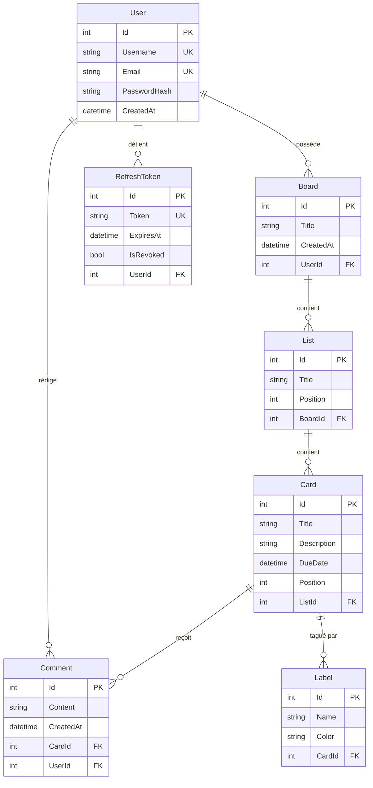

# Architecture — Diagramme de classes / entités

## Modèle de données (EF Core → PostgreSQL)



---

## Architecture backend (couches)

```
HTTP Request
     │
     ▼
┌─────────────────┐
│   Controllers   │  Reçoit les requêtes, extrait CurrentUserId du JWT,
│                 │  délègue aux services, retourne les DTOs
└────────┬────────┘
         │
         ▼
┌─────────────────┐
│    Services     │  Logique métier : validation, accès BDD via DbContext,
│                 │  émission d'événements SignalR (CardService, ListService)
└────────┬────────┘
         │
         ▼
┌─────────────────┐
│   AppDbContext  │  EF Core — mapping entités ↔ tables PostgreSQL,
│   (EF Core)     │  index uniques, cascade deletes
└─────────────────┘
```

## Architecture frontend (flux de données)

```
BoardView (état central)
    │
    ├── useBoardHub(boardId, handlers)   ← SignalR (événements temps réel)
    │
    ├── boardService / listService / cardService / commentService / labelService
    │       └── apiFetch()  ← Authorization: Bearer + refresh auto 401
    │
    ├── ListColumn[]
    │       └── CardItem  (draggable)
    │
    └── CardModal (selectedCard)
            ├── CardModalTitle        → PUT /api/cards/{id}
            ├── CardModalDescription  → PUT /api/cards/{id}
            ├── CardModalDueDate      → PUT /api/cards/{id}
            ├── CardModalComments     → POST/PUT/DELETE /api/cards/{id}/comments
            └── CardModalLabels       → POST/DELETE /api/cards/{id}/labels
```

---

## Cascade deletes configurés

| Suppression de | Entraîne la suppression de |
|---|---|
| User | Boards, Comments, RefreshTokens |
| Board | Lists |
| List | Cards |
| Card | Comments, Labels |
