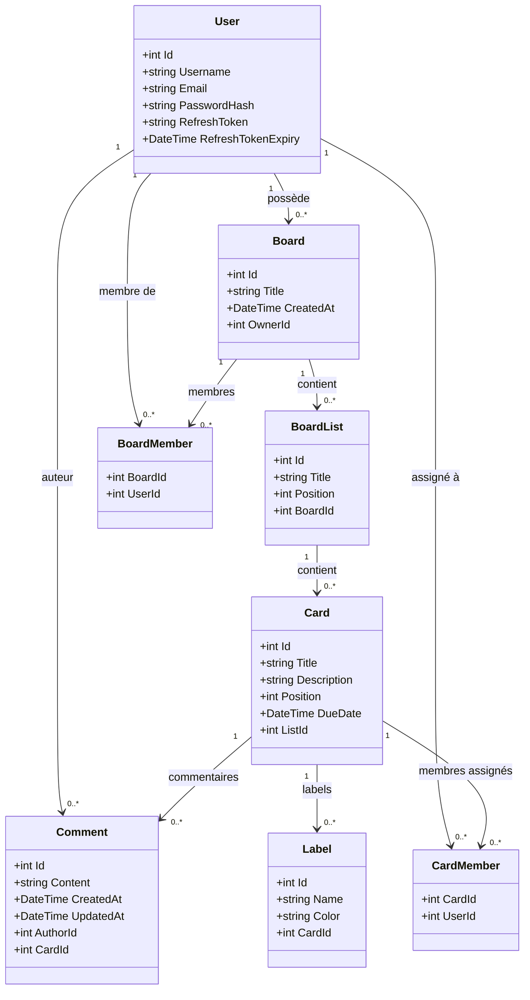

# Documentation de l'architecture — Yello

## 1. Présentation du projet

Yello est une application web de gestion de tableaux de type Kanban, inspirée de Trello. Elle permet à un utilisateur de s'inscrire, se connecter, créer des tableaux, organiser des listes et gérer des cartes représentant des tâches. Le projet repose sur une architecture client/serveur avec une interface React et une API ASP.NET Core connectée à PostgreSQL. La synchronisation entre utilisateurs est assurée en temps réel via SignalR (WebSocket).

---

## 2. Stack technique

| Couche | Technologie |
|---|---|
| Frontend | React 19 + Vite + Tailwind CSS + React Router |
| Backend | C# ASP.NET Core 10 |
| Base de données | PostgreSQL 15 |
| ORM | Entity Framework Core 10 + Npgsql |
| Authentification | JWT (access 15 min) + Refresh Token (7 jours) + BCrypt |
| Temps réel | SignalR (WebSocket) |
| Documentation API | Swagger / OpenAPI |

---

## 3. Organisation du projet

### Frontend (`frontend/`)

```
Components/    → Composants réutilisables (ListColumn, CardItem, CardModal, ...)
Views/         → Pages (LoginView, RegisterView, BoardsView, BoardView)
Models/        → Classes de données (BoardModel, CardModel, AuthModel)
Services/      → Communication avec l'API (api.js, authService, boardService, cardService, signalRService)
style/         → Fichiers CSS
```

### Backend (`backend/Yello/`)

```
Entities/      → Classes EF Core mappées sur les tables PostgreSQL
Data/          → AppDbContext (configuration EF Core, relations, migrations)
Controllers/   → Points d'entrée HTTP, ne contiennent aucune logique métier
Services/      → Logique métier (AuthService, BoardService, CardService, ...)
DTOs/          → Objets de transfert de données (entrée/sortie des controllers)
Hubs/          → Hub SignalR temps réel
Migrations/    → Fichiers de migration générés par EF Core
```

---

## 4. Architecture fonctionnelle

```
Navigateur (React)
       │
       │ HTTP/REST (JWT dans Authorization header)
       │ WebSocket (SignalR)
       ▼
API ASP.NET Core (port 5245)
       │
       ├── Controllers  → Reçoivent les requêtes, appellent les services
       ├── Services     → Logique métier, accès base via DbContext
       └── Hubs         → Gestion des groupes SignalR par boardId
       │
       ▼
PostgreSQL (yello_db)
```

L'utilisateur s'inscrit ou se connecte. Le backend génère un JWT (access token) et un refresh token. Le frontend stocke ces tokens dans le localStorage et les joint à chaque requête. Si l'access token expire, le frontend en demande automatiquement un nouveau via le refresh token.

---

## 5. Les entités principales

### User
| Attribut | Type | Description |
|---|---|---|
| Id | int | Clé primaire auto-incrémentée |
| Username | string | Nom d'affichage |
| Email | string | Identifiant de connexion (unique) |
| PasswordHash | string | Mot de passe haché avec BCrypt |
| RefreshToken | string? | Token de renouvellement (null si non connecté) |
| RefreshTokenExpiry | DateTime? | Date d'expiration du refresh token |

### Board
| Attribut | Type | Description |
|---|---|---|
| Id | int | Clé primaire |
| Title | string | Titre du tableau |
| CreatedAt | DateTime | Date de création |
| OwnerId | int | FK → User (propriétaire) |

### BoardList
| Attribut | Type | Description |
|---|---|---|
| Id | int | Clé primaire |
| Title | string | Titre de la colonne |
| Position | int | Ordre d'affichage dans le board |
| BoardId | int | FK → Board |

### Card
| Attribut | Type | Description |
|---|---|---|
| Id | int | Clé primaire |
| Title | string | Titre de la carte |
| Description | string? | Description longue |
| Position | int | Ordre d'affichage dans la liste |
| DueDate | DateTime? | Date d'échéance |
| CreatedAt | DateTime | Date de création |
| ListId | int | FK → BoardList |

### Comment
| Attribut | Type | Description |
|---|---|---|
| Id | int | Clé primaire |
| Content | string | Contenu du commentaire |
| CreatedAt | DateTime | Date d'ajout |
| UpdatedAt | DateTime? | Date de modification |
| AuthorId | int | FK → User |
| CardId | int | FK → Card |

### Label
| Attribut | Type | Description |
|---|---|---|
| Id | int | Clé primaire |
| Name | string | Nom du label (ex : urgent) |
| Color | string | Couleur hexadécimale (#c0392b) |
| CardId | int | FK → Card |

### BoardMember (jointure many-to-many)
| Attribut | Type | Description |
|---|---|---|
| BoardId | int | FK → Board (PK composite) |
| UserId | int | FK → User (PK composite) |

### CardMember (jointure many-to-many)
| Attribut | Type | Description |
|---|---|---|
| CardId | int | FK → Card (PK composite) |
| UserId | int | FK → User (PK composite) |

---

## 6. Diagramme de classes



---

## 7. Choix architecturaux

**Séparation des responsabilités (Controllers / Services / Entities)**
Les controllers reçoivent les requêtes HTTP et délèguent immédiatement aux services. Toute la logique métier (vérifications d'accès, calcul des positions, cascade) se trouve dans les services. Cela rend le code plus testable et plus lisible.

**DTOs (Data Transfer Objects)**
Les entités EF Core ne sont jamais exposées directement dans les réponses API. Des DTOs intermédiaires permettent de contrôler exactement ce qui est renvoyé, et d'éviter les références circulaires lors de la sérialisation JSON.

**Position persistée en base**
L'ordre des listes et des cartes est stocké dans un champ `Position` (entier). À chaque déplacement, les positions de tous les éléments concernés sont recalculées et sauvegardées. Cela garantit que l'ordre est restauré à la reconnexion.

**Cascade delete configuré**
La suppression d'un Board entraîne automatiquement la suppression de ses listes, qui entraîne la suppression des cartes, commentaires et labels. Ce comportement est configuré explicitement dans `OnModelCreating` pour chaque relation.

**JWT avec refresh token**
L'access token a une durée de vie courte (15 min) pour limiter les risques en cas de vol. Le refresh token (7 jours) permet de renouveler l'access token silencieusement sans redemander le mot de passe. Le refresh token est stocké en base pour pouvoir être révoqué.

**SignalR : groupes par board**
Chaque utilisateur connecté à un board rejoint un groupe SignalR `board-{id}`. Les événements (création de carte, déplacement, commentaire) sont broadcastés uniquement aux membres de ce groupe, pas à toute l'application.

---

# Documentation API — Yello

## 1. Présentation

L'API REST de Yello assure la communication entre le frontend React et la base de données PostgreSQL. Toutes les routes (sauf /api/auth/\*) requièrent un token JWT valide dans le header `Authorization: Bearer <token>`.

## 2. Routes et endpoints

### Authentification

| Méthode | Route | Description | Auth |
|---|---|---|---|
| POST | /api/auth/register | Inscription | Non |
| POST | /api/auth/login | Connexion | Non |
| POST | /api/auth/refresh | Renouvellement du token | Non |

### Boards

| Méthode | Route | Description |
|---|---|---|
| GET | /api/boards | Boards de l'utilisateur connecté |
| POST | /api/boards | Créer un board |
| GET | /api/boards/{id} | Détail d'un board |
| PUT | /api/boards/{id} | Modifier le titre |
| DELETE | /api/boards/{id} | Supprimer (propriétaire uniquement) |

### Listes

| Méthode | Route | Description |
|---|---|---|
| GET | /api/boards/{boardId}/lists | Listes d'un board (triées par position) |
| POST | /api/boards/{boardId}/lists | Créer une liste |
| PUT | /api/lists/{id} | Modifier le titre |
| PATCH | /api/lists/{id}/position | Déplacer la liste |
| DELETE | /api/lists/{id} | Supprimer |

### Cartes

| Méthode | Route | Description |
|---|---|---|
| GET | /api/lists/{listId}/cards | Cartes d'une liste (triées par position) |
| POST | /api/lists/{listId}/cards | Créer une carte |
| GET | /api/cards/{id} | Détail d'une carte |
| PUT | /api/cards/{id} | Modifier titre / description / date |
| PATCH | /api/cards/{id}/position | Déplacer la carte |
| DELETE | /api/cards/{id} | Supprimer |

### Labels et membres

| Méthode | Route | Description |
|---|---|---|
| POST | /api/cards/{cardId}/labels | Ajouter un label |
| DELETE | /api/cards/{cardId}/labels/{labelId} | Supprimer un label |
| POST | /api/cards/{cardId}/members/{userId} | Assigner un membre |
| DELETE | /api/cards/{cardId}/members/{userId} | Désassigner un membre |

### Commentaires

| Méthode | Route | Description |
|---|---|---|
| GET | /api/cards/{cardId}/comments | Commentaires d'une carte |
| POST | /api/cards/{cardId}/comments | Ajouter un commentaire |
| PUT | /api/comments/{id} | Modifier (auteur uniquement) |
| DELETE | /api/comments/{id} | Supprimer (auteur uniquement) |

### SignalR

| Endpoint | Type | Description |
|---|---|---|
| /hubs/board | WebSocket | Hub temps réel |

Méthodes appelables depuis le client : `JoinBoard(boardId)`, `LeaveBoard(boardId)`, `CardCreated`, `CardMoved`, `CardUpdated`, `CommentAdded`, `ListUpdated`.

## 3. Swagger / OpenAPI

Swagger est disponible en développement à l'adresse `http://localhost:5245/swagger`. Il permet de visualiser tous les endpoints, leurs paramètres, les corps de requête attendus et les réponses possibles, et de les tester directement depuis le navigateur.

---

# Documentation JWT — Yello

## 1. Présentation

Le système d'authentification de Yello repose sur JWT (JSON Web Token). Ce mécanisme permet d'identifier un utilisateur sans maintenir de session côté serveur. Une fois connecté, l'utilisateur reçoit un access token qu'il joint à chaque requête API. Si l'access token expire, il peut être renouvelé silencieusement via le refresh token, sans redemander le mot de passe.

## 2. Structure d'un JWT

Un JWT est composé de trois parties séparées par des points : `header.payload.signature`

- **Header** : algorithme de signature (`HS256`) et type (`JWT`)
- **Payload** : données de l'utilisateur (`sub` = userId, `email`, `username`, `jti` = identifiant unique du token, `exp` = date d'expiration)
- **Signature** : HMAC-SHA256 du header + payload avec la clé secrète — garantit que le token n'a pas été modifié

## 3. Utilisation dans Yello

**Connexion :**
1. L'utilisateur envoie email + mot de passe à `POST /api/auth/login`
2. Le backend vérifie le mot de passe avec `BCrypt.Verify`
3. Si correct : génère un access token (15 min) et un refresh token (64 octets aléatoires, stocké en base)
4. Le frontend stocke les deux tokens dans le localStorage

**Requêtes protégées :**
1. Le frontend ajoute `Authorization: Bearer <accessToken>` à chaque requête
2. Le middleware ASP.NET Core vérifie automatiquement la signature, l'émetteur, l'audience et la date d'expiration
3. Si valide : le controller reçoit la requête et extrait l'userId depuis le claim `sub`

**Renouvellement (refresh) :**
1. Si le serveur retourne 401, le frontend appelle `POST /api/auth/refresh` avec le refreshToken
2. Le backend vérifie que le refreshToken existe en base et n'est pas expiré
3. Si valide : génère une nouvelle paire access + refresh token
4. Le frontend met à jour le localStorage et réessaie la requête originale

**WebSocket (SignalR) :**
Les WebSockets ne supportent pas les headers HTTP après le handshake initial. L'access token est donc transmis via la query string (`?access_token=...`). Le middleware JWT est configuré pour lire ce paramètre pour les routes commençant par `/hubs`.

## 4. Points de vigilance

- La clé secrète JWT est stockée dans `appsettings.Development.json` (jamais dans le code ni dans `appsettings.json` en prod)
- Les mots de passe sont hachés avec BCrypt qui intègre automatiquement un sel aléatoire
- L'access token a une durée de vie courte (15 min) pour limiter l'exposition en cas de vol
- Le refresh token est stocké en base pour permettre sa révocation
- Chaque utilisateur ne peut accéder qu'aux ressources qui lui appartiennent (vérification OwnerId / BoardMember dans chaque service)
